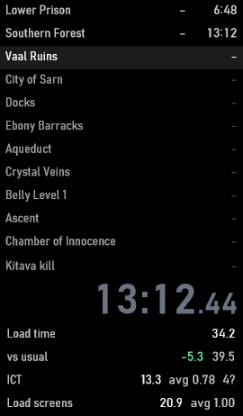

# PoE Loads for LiveSplit

A LiveSplit component that shows how much of your Path of Exile run goes to zone transitions, live, split into the two parts you pay for every time:

- **ICT** (instance creation time): from the click on a transition ("Entering <area>" appears) to the loading screen. The instance is requested on the click, so walking around meanwhile doesn't change it.
- **Load screens**: the loading screen itself.



| Row | Meaning |
|---|---|
| **on NA naively** | *(optional)* The run timer as it would read with NA-speed ICT and load screens for the same loads (averages from a US-realm race). Naive because it assumes nothing else changes. |
| **Load time** | ICT + load screens so far this run |
| **vs usual** | Difference from your usual pace for the same loads (red = slower, green = faster). The muted number is the usual time. |
| **ICT** | Total, average, and `N?` if N clicks could not be measured |
| **Load screens** | Total and average |

"Usual" is the average of your 10 most recent runs, separately for zone changes and logouts. Until you have runs saved it uses typical values.

Every load is also written to `PoELoads\<run start>.csv` next to `LiveSplit.exe` (kind, area, ICT, load screen), so each run's data stays available, including abandoned runs.

## Install

1. Download `LiveSplit.PoELoads.dll` from [Releases](../../releases).
2. Right-click it → Properties → tick **Unblock** if Windows shows it, → OK.
3. Put it in `LiveSplit\Components` and restart LiveSplit.
4. Edit Layout → **+** → Information → **PoE Loads**.

The component counts from the moment the timer starts and keeps the last run's numbers on screen after a reset until the next start.

## How it works

- **Load screens** come from `Client.txt`: each transition logs when the level is generated (the loading screen appears) and how long the loading screen lasted. The log's millisecond tick is the Windows uptime clock, the same clock LiveSplit's process sees, so no guessing is involved.
- **ICT** needs the click, which the game does not log. While the timer runs, the component copies a thin strip at the top of the game window (~60 times a second) and looks for the "Entering <area>" text that appears on click. For logouts it watches for "Contacting server..." instead. ICT is the time from that text appearing to the loading screen appearing, which is the logged loading-screen end minus its logged duration (the "Got Instance Details" moment).
- It never reads or writes game memory, sends input, or touches the network. Cost: about 3% of one CPU core while the timer runs.

## Requirements and limits

- Windows, LiveSplit 1.8 or newer.
- Game in **windowed or borderless** mode (exclusive fullscreen can capture black), 16:9. Tested at 1920×1080 and 2560×1440.
- **English** game client. Both the default UI font and the Bahnschrift UI font option are recognised.
- If the game window is covered at the moment of a click, that load gets no ICT and shows up as `N?`. It does not skew **Load time** (the run's average ICT is used for it) or **vs usual** (only measured loads are compared).

## Settings

- **Client.txt**: empty finds it automatically (running game, then the standalone, Steam and Epic default locations).
- **Measure ICT from the screen**: turn off to use only the log (load screens).
- **Show "on NA"**: adds the "on NA naively" row.
- **Save a snapshot of every missed click**: keeps the banner image of each missed click in `PoELoads\misses` for troubleshooting.
- **Write diagnostics**: if ICT is never measured, turn this on and do a few zone changes. Every 10 s it writes what the component sees (game window, monitors and DPI, capture area, anything covering the banner, banner score) to `PoELoads\diagnostics\<run>\report.txt`, with the captured frame and banner band as PNGs. The frames show your game screen, so look through them before sharing.

## Build

```
dotnet build src -c Release -p:LiveSplitDir="C:\path\to\LiveSplit"
```

Add `-p:Install=true` to copy the DLL into LiveSplit's `Components` folder (close LiveSplit first). Releases are built by GitHub Actions against the latest LiveSplit release.

## License

MIT. Not affiliated with Grinding Gear Games or LiveSplit.
